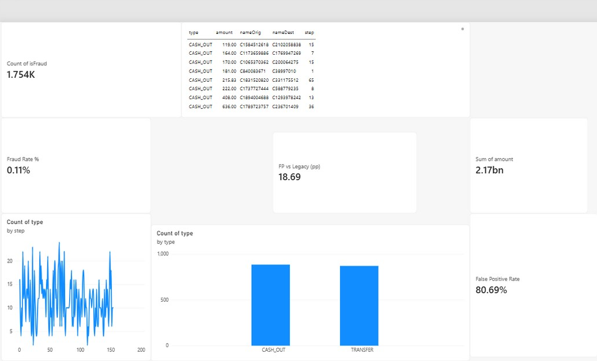
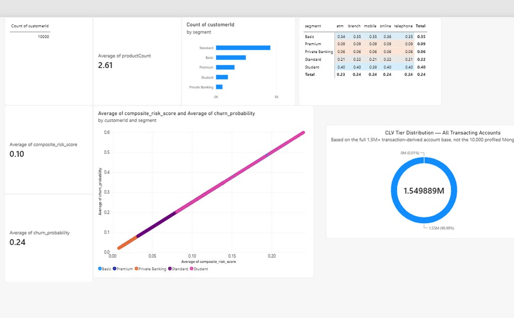
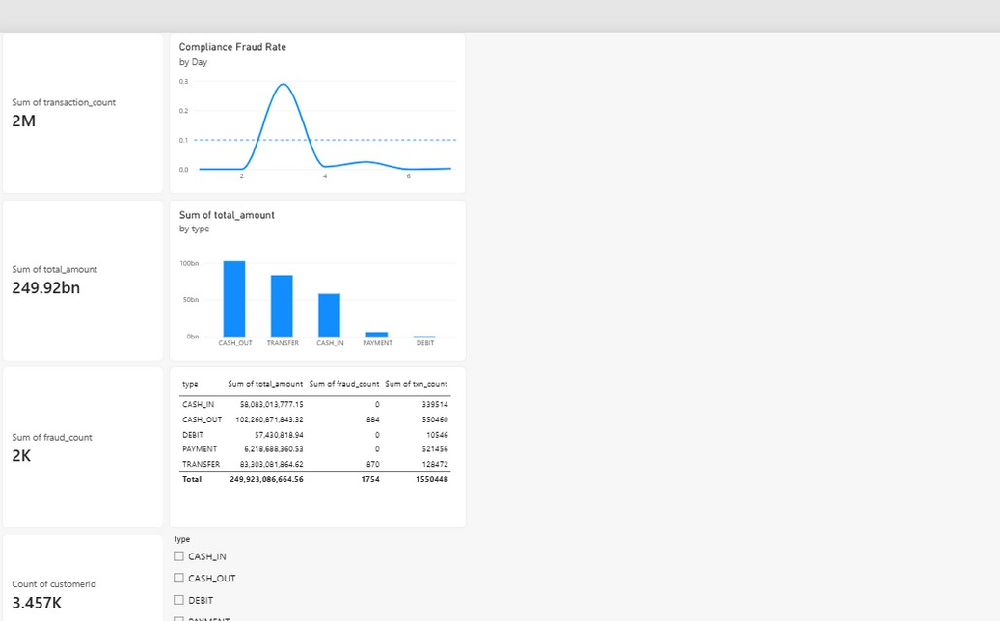

# FinSight — Banking Data Engineering & Fraud Analytics Platform

An end-to-end big data engineering project for **NovaCrest Bank**, integrating streaming ingestion, distributed storage, batch and stream processing, multiple database paradigms, data blending, and business intelligence.

FinSight explores four banking use cases:

- Real-time transaction fraud flagging
- Customer 360 and risk analytics
- Compliance reporting and account dormancy analysis
- Fraud-ring detection using graph relationships

**Built by:** Venkata Pramod

## 1. Project Overview

Financial institutions need reliable data pipelines to process large transaction volumes, integrate customer information, identify suspicious activity, and provide timely reporting.

FinSight demonstrates a data platform that combines transaction streaming, distributed processing, database integration, and Power BI reporting using a synthetic mobile-money transaction dataset and synthetic customer profiles.

### Business problems addressed

| Use case | Implementation |
|---|---|
| Transaction fraud detection | Kafka ingestion and Spark Structured Streaming rule-based scoring |
| Customer 360 | Customer profiles, risk and churn outputs, and Power BI reporting |
| Compliance reporting | Spark SQL aggregations and reporting outputs |
| Fraud-ring analysis | Neo4j account–transaction graph and Cypher queries |

**Project scope:** This is an educational portfolio project using synthetic data. Its rules and metrics are not validated for real-world banking deployment.

## 2. Key Features

- Kafka-based transaction ingestion and event streaming.
- HDFS data lake storage using Parquet.
- Spark Structured Streaming for fraud flagging and churn signals.
- Spark batch processing for risk and customer lifetime value (CLV) scoring.
- Hive tables and SQL-based reporting.
- MongoDB customer profile storage.
- Neo4j graph modelling for relationship analysis.
- Alteryx workflows for data blending.
- Power BI dashboards for fraud alerts, customer analytics, and risk reporting.

## 3. Technology Stack

| Layer | Technology | Purpose |
|---|---|---|
| Streaming ingestion | Apache Kafka | Transaction event ingestion and topic-based routing |
| Distributed storage | HDFS | Data lake storage |
| File format | Apache Parquet | Structured, partitioned data storage |
| Stream processing | Spark Structured Streaming | Fraud flagging and churn signals |
| Batch processing | Apache Spark | Risk and CLV scoring |
| SQL analytics | Spark SQL | Compliance, customer summary, and dormancy reports |
| Data warehouse | Apache Hive | External tables, fraud views, and summary outputs |
| Document database | MongoDB | Customer KYC profiles |
| Graph database | Neo4j | Account and transaction relationships |
| Data blending | Alteryx | Integration and transformation workflows |
| Business intelligence | Power BI | Interactive dashboards |

## 4. Architecture and Data Flow

```text
          Synthetic Transactions CSV
                     |
                     v
               Apache Kafka
                     |
          +----------+-----------+
          |          |           |
          v          v           v
      Fraud       Churn       HDFS Sink
      Scoring     Signals     / Parquet
          |          |           |
          v          v           v
     Flagged      HDFS       Hive / Spark SQL
     Events                  Batch Analytics
                                 |
             +-------------------+
             |
      +------+------+
      |             |
      v             v
   MongoDB         Neo4j
   Customer        Account-
   Profiles        Transaction Graph
      |             |
      +------+------+
             |
             v
          Alteryx
             |
             v
          Power BI
       Three Dashboards
```

The diagram represents the intended platform flow. Exact integrations and execution requirements should be checked against the scripts and service configuration before reproducing the environment.

## 5. Dashboard Screenshots

### Fraud Alert Board

Shows the transaction fraud-flagging outputs, exposure indicators, and fraud-related metrics.



### Customer 360

Presents customer segments, risk and churn indicators, and profile-related analytics.



### Risk and Compliance

Presents transaction trends, risk indicators, compliance summaries, and dormancy reporting.



The dashboards are based on the project outputs and should be interpreted in light of the data limitations described below.

## 6. Dataset and Data Quality

### Transaction dataset

The primary transaction dataset follows the PaySim synthetic financial transaction schema. The full transaction CSV is not included in this repository.

| Property | Reported value |
|---|---|
| Rows | 1,550,448 |
| Columns | 11 |
| File size | Approximately 121 MB |
| Simulated time steps | 154 |
| Labelled fraud records | 1,754 |
| Labelled fraud proportion | Approximately 0.113% |

The dataset contains transaction types, amounts, origin and destination identifiers, account balances, and fraud labels.

To reproduce the transaction-processing stages, obtain a compatible PaySim-format dataset from its authorized distribution source and place it at:

`data/Transactions.csv`

Confirm the file's schema and the right to use and redistribute it before running the pipeline.

### Customer profiles

`data/novacrest_customers.json` contains synthetic customer profile records used in the MongoDB component.

The profiles include fields such as customer ID, segment, products, KYC status, risk score, churn probability, and preferred channel.

### Neo4j graph data

The `data/` directory contains CSV files for graph nodes and relationships:

- `neo4j_accounts_nodes.csv`
- `neo4j_transaction_nodes.csv`
- `neo4j_sent_rels.csv`
- `neo4j_received_rels.csv`

The graph represents accounts connected through transactions, allowing relationship-based analysis.

### Data quality considerations

The transaction labels are highly imbalanced, and most origin account identifiers appear only once. The synthetic customer profiles were generated independently of the transaction account identifiers.

Consequently, customer joins and behaviour-based signals have important limitations. These issues should be considered when interpreting fraud, churn, and customer risk outputs.

## 7. Setup and Execution

### Prerequisites

The existing project documentation identifies the following environment components:

- Python 3.10 or later
- Hadoop 3.x and HDFS
- Apache Kafka
- Apache Spark 3.5.x
- Hive metastore
- MongoDB
- Neo4j
- Alteryx for the supplied workflows
- Power BI Desktop for the supplied report

The components may require separate configuration. Exact compatibility, Kafka connector dependencies, environment variables, and service startup order must be verified for your installation.

### Step 1: Clone the repository

```bash
git clone https://github.com/venkatapramod/finsight-data-platform.git
cd finsight-data-platform
```

### Step 2: Prepare the transaction data

Obtain the compatible transaction CSV and place it at:

```text
data/Transactions.csv
```

The full transaction file is intentionally not included in the repository.

### Step 3: Configure the services

Start and configure the required Kafka, Hadoop/HDFS, Spark, Hive, MongoDB, and Neo4j services.

Ensure that the configured addresses, ports, credentials, and data paths match those expected by the project scripts.

### Step 4: Create Kafka topics

The documented ingestion design uses `txn-raw`, `txn-flagged`, and `txn-churn`.

```bash
kafka-topics.sh --create \
  --topic txn-raw \
  --partitions 3 \
  --replication-factor 1 \
  --bootstrap-server localhost:9092
```

Create the other topics using the same approach, checking first whether they already exist.

### Step 5: Run processing jobs

The following commands are drawn from the original project documentation. Verify each script path, its arguments, and required connector JARs before execution.

```bash
# Transaction ingestion
python code/kafka/producer.py --quiet

# Batch data loading
spark-submit code/spark/load_transactions.py

# Streaming fraud processing
spark-submit --jars <kafka-jars> \
  code/spark/fraud_streaming.py

# Customer baseline
spark-submit \
  code/spark/compute_customer_baseline.py

# Churn processing
spark-submit --jars <kafka-jars> \
  code/spark/churn_streaming.py
```

### Step 6: Run batch analytics

```bash
spark-submit code/spark/risk_scoring.py
spark-submit code/spark/clv_scoring.py

spark-submit code/spark/spark_sql_jobs.py \
  --mode compliance

spark-submit code/spark/spark_sql_jobs.py \
  --mode customer_summary

spark-submit code/spark/spark_sql_jobs.py \
  --mode dormancy
```

### Step 7: Load database objects

```bash
spark-sql -f code/sql/hive_ddl.sql
spark-sql -f code/sql/fraud_view.sql
```

Load the customer profiles into MongoDB:

```bash
mongoimport \
  --db finsight \
  --collection customers \
  --file data/novacrest_customers.json \
  --jsonArray
```

Configure Neo4j credentials through an environment variable before running the graph loader:

```bash
export NEO4J_PASSWORD='<your-password>'
python code/neo4j/neo4j_loader.py
```

Never commit real credentials or replace the placeholder with a real password in this README.

### Step 8: Open the reporting assets

- Alteryx workflows: `alteryx/`
- Power BI report assets: `docs/`
- Dashboard screenshots: `images/`

The PDF files in `docs/` are report/documentation assets; confirm the location of the actual `.pbix` report file before describing it as included and directly openable.

## 8. Results and Validation

The following figures are reported in the existing project documentation. They describe the recorded project runs, not independently reproduced results from a fresh installation.

| Metric | Reported result |
|---|---:|
| Producer throughput | Approximately 999.8 messages/sec for 50K records |
| Producer throughput | Approximately 989.7 messages/sec for 200K records |
| Streaming run | 200,000 records consumed |
| Streaming output | 989 flagged records |
| HDFS landing | Parquet across 154 step partitions |
| Hive external table | 1,550,448 rows |
| Fraud view | 1,754 rows |
| MongoDB customer profiles | 10,000 documents |
| Neo4j graph | 499 accounts and 1,554 transactions |
| Graph relationships | 3,108 edges |
| Fraud-ring query output | 157 accounts meeting the documented query condition |

For implementation details and recorded terminal outputs, see `docs/FinSight_Report_Updated.pdf`.

### Validation before relying on results

- Confirm the input file row count and schema.
- Verify Kafka topic creation and consumption.
- Check Spark job completion and output counts.
- Confirm HDFS partitions and Hive query results.
- Check MongoDB document counts and indexes.
- Validate Neo4j nodes, relationships, and query results.
- Recalculate fraud precision, recall, and false-positive rate against ground-truth labels.
- Check that Power BI measures match their source data.

## 9. Known Limitations and Future Improvements

The original implementation documents the following limitations.

### Fraud-rule precision

The rule-based approach reported an 80.69% false-positive rate, compared with a 62% legacy baseline cited in the project documentation.

A potential next experiment is to evaluate sender-balance features alongside destination-balance features. Any improvement should be measured against labelled data using precision, recall, false-positive rate, and an appropriate validation split.

### Customer profile joins

Only 2 of the 10,000 customer profiles matched the transaction identifiers in the documented run. The profiles and transaction identifiers were generated independently.

A future improvement is to generate a deterministic mapping between synthetic profiles and transacting accounts, then validate join coverage and the resulting Customer 360 metrics.

### Churn frequency baseline

The transaction dataset contains limited repeated activity for most origin accounts. This constrains the usefulness of frequency-based behavioural signals.

A future iteration could introduce a minimum-history requirement and evaluate signals using data with more repeated customer activity.

### Data integration

The existing documentation states that Hive ODBC was unavailable in the tested environment, so an exported CSV was used by the Alteryx workflow instead of querying the mart directly.

Configuring HiveServer2 and validating the ODBC connection would allow the integration path to be tested more directly.

### Power BI connectivity

The existing dashboards use Import mode rather than DirectQuery. A future iteration could evaluate refresh workflows or alternative connectivity modes where supported by the data source and deployment environment.

### Additional engineering improvements

- Add automated unit and integration tests.
- Add data-quality checks and schema validation.
- Centralize configuration and document dependency versions.
- Add pipeline failure handling, retries, and structured logging.
- Automate deployment and reproducibility checks.
- Evaluate fraud rules on separate validation data before making performance claims.

## 10. Repository Structure, Security, and Contact

### Repository structure

```text
finsight-data-platform/
├── alteryx/       # Alteryx workflows and outputs
├── code/          # Python, Spark, SQL, and graph-processing code
├── data/          # Customer profiles and Neo4j CSV assets
├── docs/          # Project reports and documentation
├── images/        # Dashboard screenshots
├── .gitignore
└── README.md
```

The repository may contain additional nested files; consult the current GitHub tree for the complete listing.

### Security and data handling

- Do not commit passwords, API keys, personal credentials, or private configuration.
- Keep large datasets out of Git unless their licensing and repository size are appropriate.
- Use synthetic data for demonstrations.
- Store local secrets in environment variables or an untracked local configuration file.
- Review third-party dataset and software licenses before redistributing them.

### License

A license has not yet been added to this repository. Until one is selected and committed, do not assume that others have permission to reuse, modify, or redistribute the project code.

### Author

**Venkata Pramod**

Email: [pramodvchalla@gmail.com](mailto:pramodvchalla@gmail.com)

GitHub: [venkatapramod](https://github.com/venkatapramod)

---

*FinSight is an educational data engineering and analytics portfolio project. It is not a production banking system, and its fraud flags and risk scores should not be used to make real financial decisions.*
